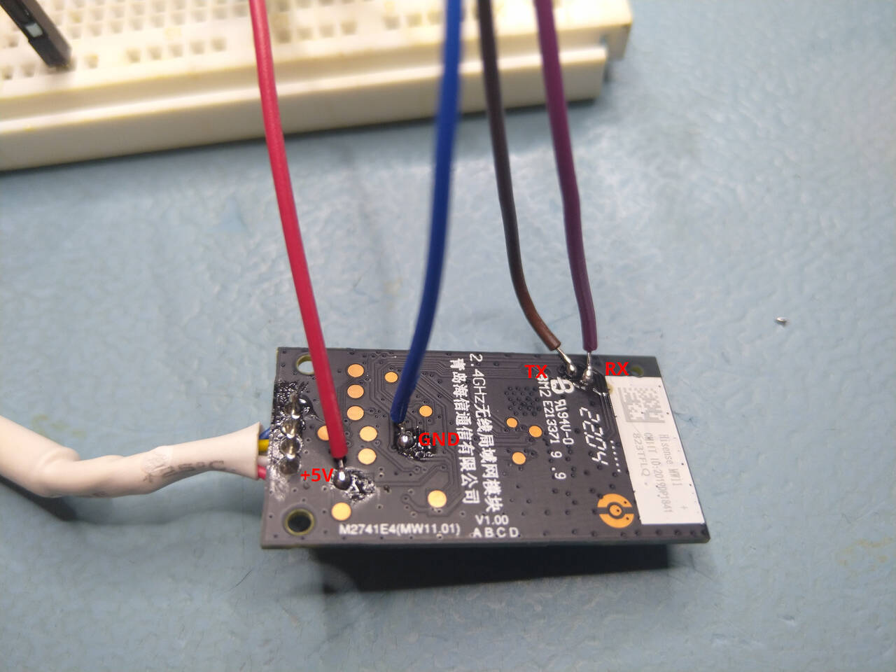

# Flashing ESPHome on the factory AEH-W4G2 module

The AEH-W4G2 Wi-Fi module has a Realtek RTL8710BL chip in it, which is capable of running ESPHome. The only limitation of that chip for this project is the 1MB flash chip used on the board. It can either run ESPHome and provide connectivity via MQTT and you can keep the option to update the firmware using OTA updates.

You can have full ESPHome API or Web interface control on the stock board if you are fine with not being able to update the firmware via OTA and you are fine with having to reflash it via UART if you want to update it or make changes. (Realistically, if it works well, you don't need to reflash it.)

Or you can upgrade the boards flash chip to a 2MB one, and have full functionality AND have OTA updates working. Info on how to do this can be found [TODO ADD LINK].

Note: This guide is not very beginner friendly. I assume that you are familiar with a terminal, basic troubleshooting and using/flashing ESPHome onto devices. This project is not ideal as a first introduction to ESPHome.

## Requirements:
- AEH-W4G2 Wi-Fi module
- Beginner soldering skills and equipment
- A ***GOOD*** USB-UART adapter: :warning: **Check this before attempting to flash or even connecting to the chip!** It can save you a lot of debugging. The chip needs to support at least 1.5M baud rate, to complete the handshake and be able to talk to the RTL8710BL chip as [described by LibreTiny](https://docs.libretiny.eu/docs/platform/realtek-ambz/#flashing). Common CP2102 based adapters are not suitable. I have successfully used a PL2303 based adapter on Linux, but the LibreTiny docs mention it explicitly as a non working example under Windows. They recommend a FT232RL based board.
- [ltchiptool](https://docs.libretiny.eu/docs/flashing/tools/ltchiptool/) You can create a venv, and install it with `pip install ltchiptool`. You may need to run it as root to have access to the UART adapter.
- the compiled ESPHome yaml file. After updating it with your variables, you can compile it with `esphome compile your_file.yaml`. ESPHome can be installed via `pip install esphome`.

## Flashing
Disconnect the module from the AC unit (and the AC unit from mains) before flashing.

I am not liable for any damage to you, your board, or your AC.

1. Solder RX and TX to the board (and optionally 5V and GND, or you can use the factory connector to connect those)
   
   Note: Picture with a complete pinout can also be found in the [media](../media) folder.
2. (Optional) Connect to your UART adapter. (Adapter RX to board TX and vice versa.) The original firmware's log output should be visible at 115200 baud using a suitable program. You can save it if you want to.
3. Put the board into download mode:
	1. disconnect power (5V)
	2. connect TX (of the Wi-Fi board) to GND
	3. reconnect power (5V)
	4. release TX from GND (and connect to your adapters RX, if you disconnected it)
	5. verify the chip is in download mode by running: `ltchiptool flash info realtek-ambz` You should see output like this:
```
I: Available COM ports:
I: |-- ttyUSB0 - USB-Serial Controller - Prolific Technology Inc. (067B/2303)
I: |   |-- Selecting this port. To override, use -d/--device
I: Connecting to 'Realtek AmebaZ' on /dev/ttyUSB0 @ 1500000
I: Transmission successful (ACK received).
I: Transmission successful (ACK received).
I: |-- Success! Chip info: Unknown 0xF7
I: Reading chip info...
I: Chip: Unknown 0xF7
I: Transmission successful (ACK received).
I: Transmission successful (ACK received).
I: +---------------------+--------------------------------+
I: | Name                | Value                          |
I: +---------------------+--------------------------------+
I: | Chip Type           | Unknown 0xF7                   |
I: | MAC Address         | CA:2C:4F:CA:A7:D9              |
I: |                     |                                |
I: | Flash ID            | C8 40 14                       |
I: | Flash Size (real)   | 1 MiB                          |
I: |                     |                                |
I: | OTA2 Address        | 0x8080000                      |
I: | RDP Address         | 0x80FF000                      |
I: | RDP Length          | 0xFF0                          |
I: | Flash SPI Mode      | QIO                            |
I: | Flash SPI Speed     | 100MHZ                         |
I: | Flash ID (system)   | FFFF                           |
I: | Flash Size (system) | 2 MiB                          |
I: | LOG UART Baudrate   | 115200                         |
I: |                     |                                |
I: | SYSCFG 0/1/2        | 40000200 / 02010301 / 00000001 |
I: | ROM Version         | V0.1                           |
I: | CUT Version         | 0                              |
I: +---------------------+--------------------------------+
I: |-- Finished in 5.298 s
```

If you instead see the following, check your wiring and retry putting the chip into download mode:

```
I: Connect UART2 of the Realtek chip to the USB-TTL adapter:
I:          TX | ------ | RX2 (Log_RX / PA29) 
I:             |        |                     
I:         GND | ------ | GND                 
I:     --------+        +---------------------
I:  
I: Using a good, stable 3.3V power supply is crucial. Most flashing issues
I: are caused by either voltage drops during intensive flash operations,
I: or bad/loose wires.
I:  
I: The UART adapter's 3.3V power regulator is usually not enough. Instead,
I: a regulated bench power supply, or a linear 1117-type regulator is recommended.
I:  
I: In order to flash the chip, you need to enable download mode.
I: This is done by pulling CEN to GND briefly, while still keeping the TX2 pin
I: connected to GND.
I:  
I: Do this, in order:
I:  - connect CEN to GND
I:  - connect TX2 to GND
I:  - release CEN from GND
I:  - release TX2 from GND
```

4.  (Optional) save the original firmware from the chip. Run `ltchiptool flash read realtek-ambz -d /dev/ttyUSB0 stock_firmware.bin` Output should look like:

```
I: Connecting to 'Realtek AmebaZ' on /dev/ttyUSB0 @ 1500000
I: Transmission successful (ACK received).
I: Transmission successful (ACK received).
I: |-- Success! Chip info: Unknown 0xF7
I: Reading Flash (1 MiB) to 'stock_firmware.bin'
  [################################################################]  100%          I: Transmission successful (ACK received).
I: Transmission successful (ACK received).

I: |-- Finished in 45.568 s 
```

5. Flash ESPHome by running `ltchiptool flash write -d /dev/ttyUSB0 /your/path/.esphome/build/your_device/.pioenvs/your_device/firmware.bin `. 
	   Output should look like:

```
I: Detected file type: UF2 - esphome 202X.X.X
I: Connecting to 'Realtek AmebaZ' on /dev/ttyUSB0 @ 1500000
I: Transmission successful (ACK received).
I: Transmission successful (ACK received).
I: |-- Success! Chip info: Unknown 0xF7
I: Writing '/some/path/ESPHome/.esphome/build/mcklima/.pioenvs/mcklima/firmware.bin'
I: |-- esphome 202X.X.X @ 2025-07-03 13:49:04 -> generic-rtl8710bn-2mb-788k
OTA 1 (0x00B000)  [################################################################]  100%          I: Transmission successful (ACK received).
I: Transmission successful (ACK received).
Booting firmware  [################################################################]  100%          I: Transmission successful (ACK received).
I: Transmission successful (ACK received).
I: |-- Finished in 25.207 s
```
That should be it. Reconnect the board to your AC and check if you can see any info. If it works, then congrats, you did it!

## Troubleshooting
General troubleshooting tips and info can be found in [troubleshooting.md](troubleshooting.md).

## Reverting to factory Firmware
If you want to revert to the factory firmware you can do it by running `flash write -frealtek-ambz -s 0x0 -d /dev/ttyUSB0 /your_path/firmware_backup.bin`. There is a completely stock, un-setup firmware dump available in the repo under [firmware](../firmware).