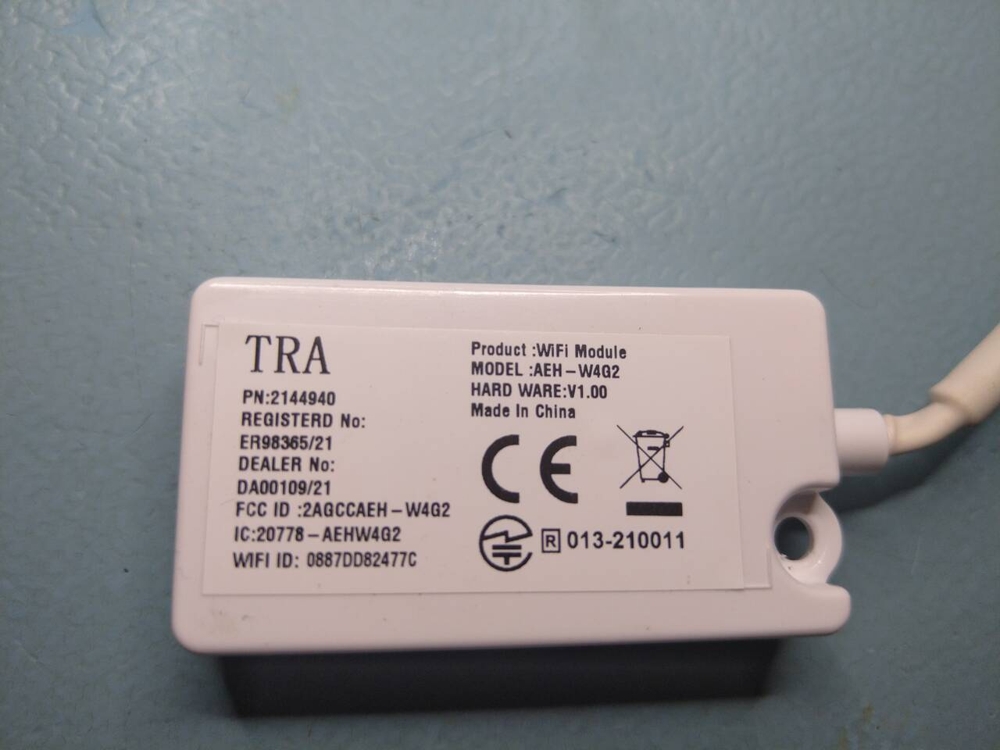
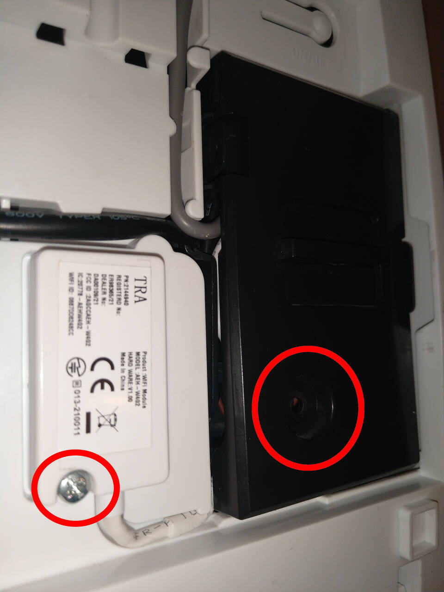
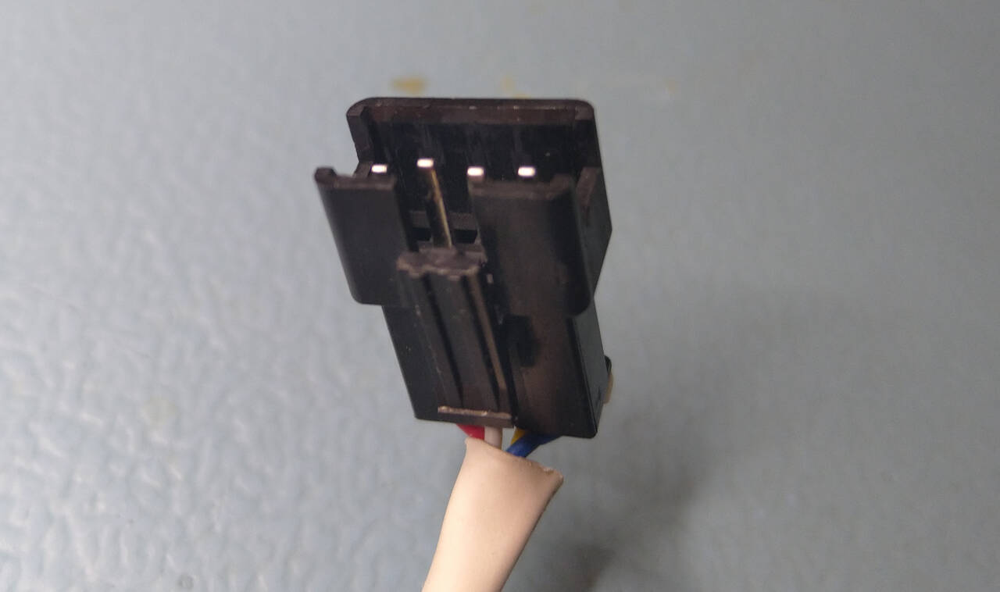
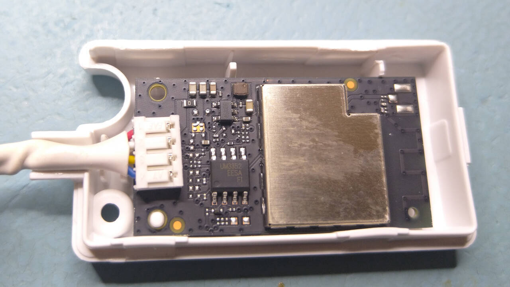
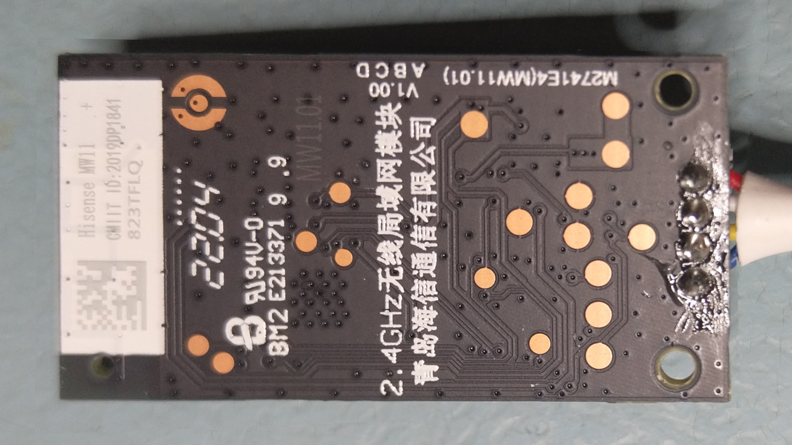
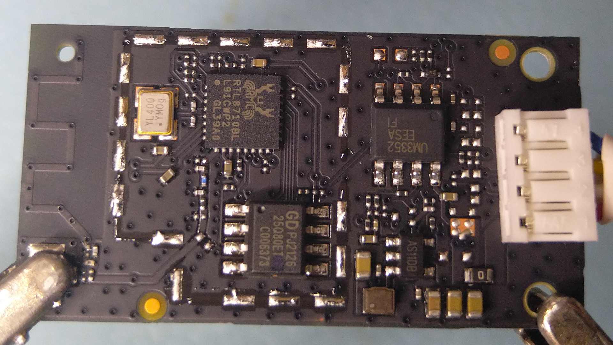
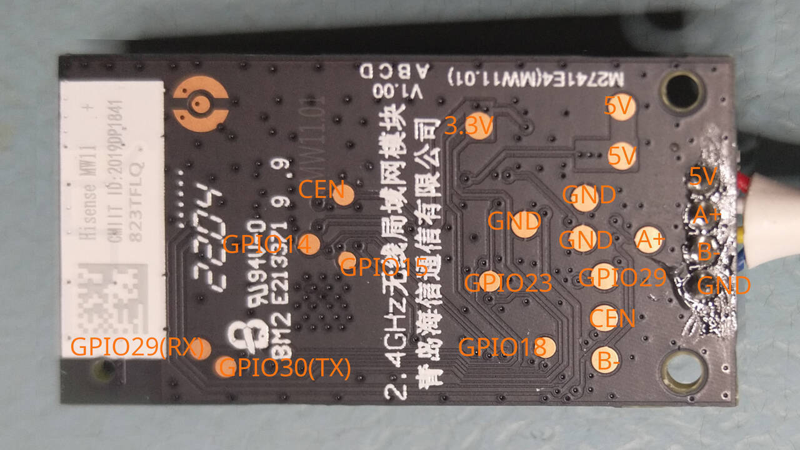

# Hardware Reference for AEH-W4G2 module

The AEH-W4G2 module can be identified by the markings visible in the image:

Normally, if your AC came with it, it should be visible if you just open up the top cover (for Hisense models). The position of the module inside the AC is visible in the image below:

The red circles indicate the 2 screw positions; remove these screws to free the module.

:warning: Note: under the black cover, there are live wires next to where the module can be disconnected. Disconnect the AC from mains before you attempt to unplug the module cable. My connector had a clamp/bracket that was holding the connector to the plug, and that had to be pried off first, before the connector could be disconnected.

The module uses a 4-pin JST-SM connector:

The connector pinout is:

| Pin | Signal | Wire colour |
|-----|--------|-------------|
| 1 | +5V | red |
| 2 | RS485 A+ | white |
| 3 | RS485 B- | yellow |
| 4 | GND | blue |

The pinout is also detailed in [the FCC document](FCC/AEH-W4G2_FCC_1.pdf).

If you removed the module from the AC you can open up the box and access the board inside:

The board has 3 main components: 
- The RTL8710BL chip
- A GD25Q80 1MB flash chip
- An UM3352E RS-485 transceiver

The chips and exact markings are visible in the picture:

Datasheets for the flash and RS485 chips can easily be found on the internet. The RTL8710BL datasheet can be found [here](https://docs.libretiny.eu/docs/platform/realtek-ambz/) under Resources.

The board bottom has a bunch of test points. The exact pinout is visible in this image:

## Firmware
The board's factory firmware can be found [here](../firmware). It uses a baud rate of `9600` to communicate with the AC via the RS-485 transceiver. `PA23` (GPIOA_23) is TX, `PA18` (GPIOA_18) is RX, and `PA14` (GPIOA_14) is connected to the RS-485 transceiver as a flow control pin.

The UART2_RX and UART2_TX (PA29 and PA30) can be used to read the device's logs at a baud rate of 115200.